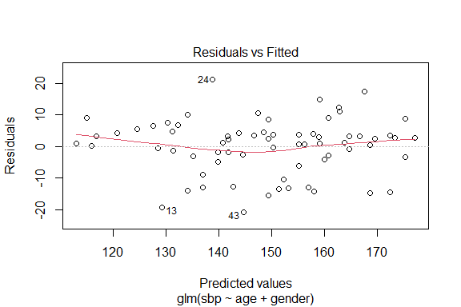
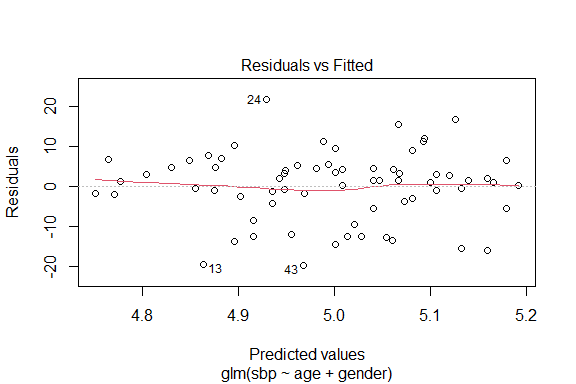
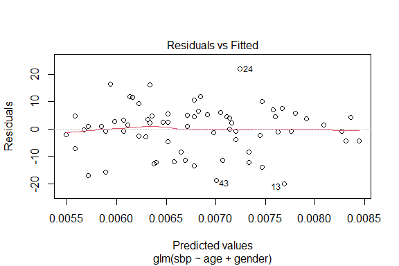
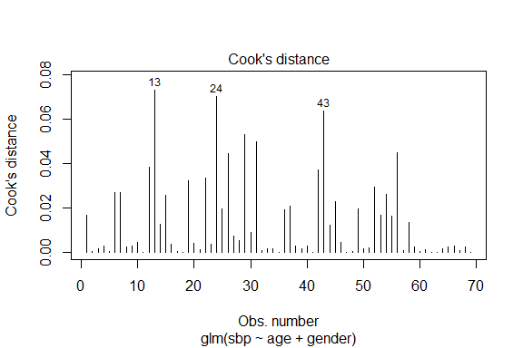
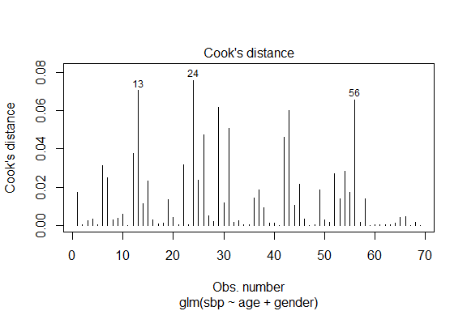
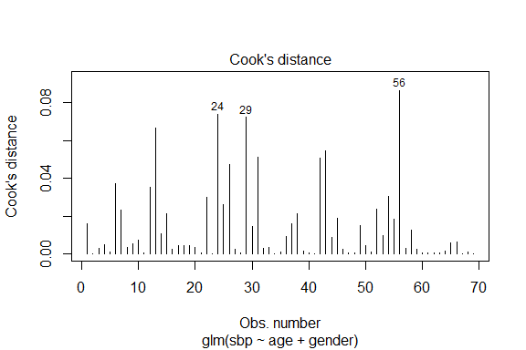
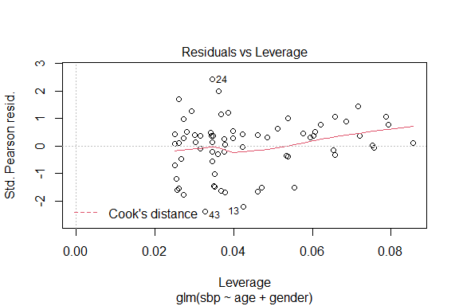
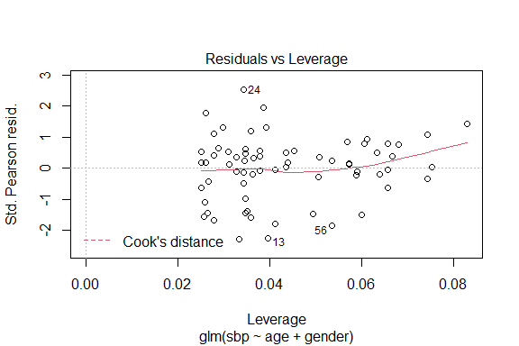
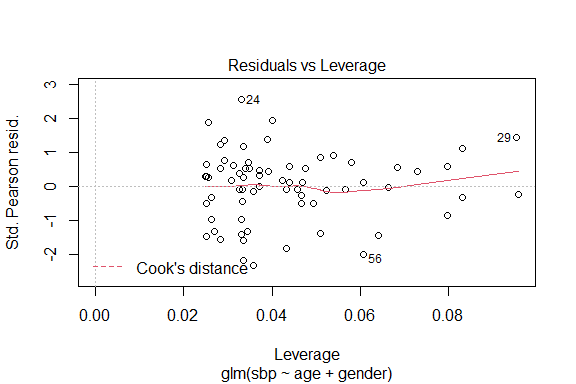

# Analytical exercise of building a generalized linear model

This document presents a continuation of the analysis from the previous exercise, this time using the generalized linear model.

The data contained in the `sbp.csv` file contain observations from 70 patients. Each observation consists of the following variables:

-   sbp -- systolic blood pressure in mmHg
-   age -- the age of the patient
-   gender -- patient's gender

The aim of the study is to estimate a generalized linear model that explains the blood pressure level better than a simple linear model.

The adopted significance level in statistical tests is 0.05.

Literature: D. G. Kleinbaum, L. L. Kupper, K. E. Muller, A. Nizam, A. (1998), Applied Regression Analysis and Other Multivariable Methods, Duxbury Press, North Scituate, MA


#### Used libraries


```r
library("car")
library("ggplot2")
library("pscl")
library("lmtest")
```

### Data loading and initial analysis


```r
df1 <-  read.table("../data/sbp.csv", header = TRUE, sep = ";",dec=",")
df1$gender <- as.factor(df1$gender)
```

Descriptive statistics for variables in the dataset:


```r
summary(df1)
```

```
##     gender        sbp             age          gender_0_1    
##  female:29   Min.   :110.0   Min.   :17.00   Min.   :0.0000  
##  male  :41   1st Qu.:135.2   1st Qu.:36.50   1st Qu.:0.0000  
##              Median :149.5   Median :47.00   Median :1.0000  
##              Mean   :149.7   Mean   :46.16   Mean   :0.5857  
##              3rd Qu.:162.0   3rd Qu.:58.50   3rd Qu.:1.0000  
##              Max.   :220.0   Max.   :70.00   Max.   :1.0000
```

### Selection of the GLM model type for the variable Y = sbp

Models are estimated for the $Y$ variable with a normal distribution `family = gaussian` with different link functions.


#### Identity link function

The generalized linear model estimated with the identity link function is equivalent to the linear model. In the previous exercise, the linear models estimated by the least squares method were used, so now the maximum likelihood method will be used.

In the following formula, the default value of the argument `link = identity`.


```r
m4 <- glm(sbp ~ age + gender, data = df1, subset = 1:69, family = gaussian)
summary(m4)
```

```
## 
## Call:
## glm(formula = sbp ~ age + gender, family = gaussian, data = df1, 
##     subset = 1:69)
## 
## Deviance Residuals: 
##     Min       1Q   Median       3Q      Max  
## -20.705   -3.299    1.248    4.325   21.160  
## 
## Coefficients:
##             Estimate Std. Error t value Pr(>|t|)    
## (Intercept) 96.77353    3.62085  26.727  < 2e-16 ***
## age          0.95606    0.07153  13.366  < 2e-16 ***
## gendermale  13.51345    2.16932   6.229  3.7e-08 ***
## ---
## Signif. codes:  0 '***' 0.001 '**' 0.01 '*' 0.05 '.' 0.1 ' ' 1
## 
## (Dispersion parameter for gaussian family taken to be 78.81801)
## 
##     Null deviance: 23212  on 68  degrees of freedom
## Residual deviance:  5202  on 66  degrees of freedom
## AIC: 502.08
## 
## Number of Fisher Scoring iterations: 2
```

Model 4: $sbp = 96.7735 + 0.9561 * age + 13.5135 * gender$

**Findings**: The `age` and `gender` variables are statistically significant (Wald test for cumulative significance).

Additionally, a test of significance of all independent variables in the model was performed. Either the likelihood-ratio test or the Wald test can be performed.


```r
lrtest(m4)
```

```
## Likelihood ratio test
## 
## Model 1: sbp ~ age + gender
## Model 2: sbp ~ 1
##   #Df  LogLik Df Chisq Pr(>Chisq)    
## 1   4 -247.04                        
## 2   2 -298.64 -2 103.2  < 2.2e-16 ***
## ---
## Signif. codes:  0 '***' 0.001 '**' 0.01 '*' 0.05 '.' 0.1 ' ' 1
```

```r
waldtest(m4)
```

```
## Wald test
## 
## Model 1: sbp ~ age + gender
## Model 2: sbp ~ 1
##   Res.Df Df      F    Pr(>F)    
## 1     66                        
## 2     68 -2 114.25 < 2.2e-16 ***
## ---
## Signif. codes:  0 '***' 0.001 '**' 0.01 '*' 0.05 '.' 0.1 ' ' 1
```

**Conclusion**: Both `age` and `gender` are statistically significant independently.

A linear model with variable age and gender was obtained. A comparison of the **model 3** obtained by the least squares method with the **model 4** obtained by the maximum likelihood method is shown below.

**Model 3** estimation results from the previous document.


```r
m3 <- lm(sbp ~ age + gender, data = df1, subset = 1:69)
summary(m3)
```

```
## 
## Call:
## lm(formula = sbp ~ age + gender, data = df1, subset = 1:69)
## 
## Residuals:
##     Min      1Q  Median      3Q     Max 
## -20.705  -3.299   1.248   4.325  21.160 
## 
## Coefficients:
##             Estimate Std. Error t value Pr(>|t|)    
## (Intercept) 96.77353    3.62085  26.727  < 2e-16 ***
## age          0.95606    0.07153  13.366  < 2e-16 ***
## gendermale  13.51345    2.16932   6.229  3.7e-08 ***
## ---
## Signif. codes:  0 '***' 0.001 '**' 0.01 '*' 0.05 '.' 0.1 ' ' 1
## 
## Residual standard error: 8.878 on 66 degrees of freedom
## Multiple R-squared:  0.7759,	Adjusted R-squared:  0.7691 
## F-statistic: 114.2 on 2 and 66 DF,  p-value: < 2.2e-16
```

**Findings**: The GLM model estimated by the maximum likelihood method for the variable Y with a normal distribution with an identity link function is equivalent to the classical linear model estimated by the least squares method (models are identical).


#### Logarithmic link function


```r
m5 <- glm(sbp ~ age + gender, data = df1, subset = 1:69, family = gaussian(link = "log"))
summary(m5) 
```

```
## 
## Call:
## glm(formula = sbp ~ age + gender, family = gaussian(link = "log"), 
##     data = df1, subset = 1:69)
## 
## Deviance Residuals: 
##     Min       1Q   Median       3Q      Max  
## -19.658   -3.630    1.418    4.761   21.750  
## 
## Coefficients:
##              Estimate Std. Error t value Pr(>|t|)    
## (Intercept) 4.6391397  0.0263232 176.237  < 2e-16 ***
## age         0.0065892  0.0004919  13.397  < 2e-16 ***
## gendermale  0.0910815  0.0146242   6.228 3.72e-08 ***
## ---
## Signif. codes:  0 '***' 0.001 '**' 0.01 '*' 0.05 '.' 0.1 ' ' 1
## 
## (Dispersion parameter for gaussian family taken to be 76.88192)
## 
##     Null deviance: 23211.8  on 68  degrees of freedom
## Residual deviance:  5074.2  on 66  degrees of freedom
## AIC: 500.36
## 
## Number of Fisher Scoring iterations: 4
```
Model 5: $\log(sbp) = 4.6391 + 0.0066 * age + 0.0911 * gender$

**Findings**: The `AIC` value is lower than in the previous model, which proves its better fit.


##### Significance tests of variables


```r
lrtest(m5)
```

```
## Likelihood ratio test
## 
## Model 1: sbp ~ age + gender
## Model 2: sbp ~ 1
##   #Df  LogLik Df  Chisq Pr(>Chisq)    
## 1   4 -246.18                         
## 2   2 -298.64 -2 104.91  < 2.2e-16 ***
## ---
## Signif. codes:  0 '***' 0.001 '**' 0.01 '*' 0.05 '.' 0.1 ' ' 1
```

```r
waldtest(m5)
```

```
## Wald test
## 
## Model 1: sbp ~ age + gender
## Model 2: sbp ~ 1
##   Res.Df Df      F    Pr(>F)    
## 1     66                        
## 2     68 -2 113.92 < 2.2e-16 ***
## ---
## Signif. codes:  0 '***' 0.001 '**' 0.01 '*' 0.05 '.' 0.1 ' ' 1
```

**Conclusion**: Both `age` and `gender` are statistically significant.


#### Inverse link function


```r
m6 <- glm(sbp ~ age + gender, data = df1, subset = 1:69, family = gaussian(link = "inverse"))
summary(m6) 
```

```
## 
## Call:
## glm(formula = sbp ~ age + gender, family = gaussian(link = "inverse"), 
##     data = df1, subset = 1:69)
## 
## Deviance Residuals: 
##     Min       1Q   Median       3Q      Max  
## -20.024   -4.282    1.015    4.785   21.992  
## 
## Coefficients:
##               Estimate Std. Error t value Pr(>|t|)    
## (Intercept)  9.204e-03  1.891e-04  48.672  < 2e-16 ***
## age         -4.449e-05  3.380e-06 -13.164  < 2e-16 ***
## gendermale  -5.983e-04  9.870e-05  -6.062 7.24e-08 ***
## ---
## Signif. codes:  0 '***' 0.001 '**' 0.01 '*' 0.05 '.' 0.1 ' ' 1
## 
## (Dispersion parameter for gaussian family taken to be 77.13449)
## 
##     Null deviance: 23211.8  on 68  degrees of freedom
## Residual deviance:  5090.9  on 66  degrees of freedom
## AIC: 500.59
## 
## Number of Fisher Scoring iterations: 4
```

Model 6: $\frac{1}{sbp} = 0.009204 - 0.000044 * age - 0.000598 * gender$

**Notice**: The structural parameters are negative. So as the explanatory variable grows, the explained variable decreases.


##### Significance tests of variables


```r
lrtest(m6)
```

```
## Likelihood ratio test
## 
## Model 1: sbp ~ age + gender
## Model 2: sbp ~ 1
##   #Df  LogLik Df  Chisq Pr(>Chisq)    
## 1   4 -246.29                         
## 2   2 -298.64 -2 104.69  < 2.2e-16 ***
## ---
## Signif. codes:  0 '***' 0.001 '**' 0.01 '*' 0.05 '.' 0.1 ' ' 1
```

```r
waldtest(m6)
```

```
## Wald test
## 
## Model 1: sbp ~ age + gender
## Model 2: sbp ~ 1
##   Res.Df Df      F    Pr(>F)    
## 1     66                        
## 2     68 -2 110.23 < 2.2e-16 ***
## ---
## Signif. codes:  0 '***' 0.001 '**' 0.01 '*' 0.05 '.' 0.1 ' ' 1
```

**Conclusion**: Both `age` and `gender` are statistically significant.


### Diagnostic charts for models 4-6

Check if the mean of residuals is close to zero, if the scatter of residuals is independent of the variable y and if there are no outliers.


```r
plot(m4, which = 1)
```

<!-- -->

```r
plot(m5, which = 1)
```

<!-- -->

```r
plot(m6, which = 1)
```

<!-- -->


Detection of atypical observations using the **Bonferroni Outlier test**.


```r
outlierTest(m4, n.max = Inf)
```

```
## No Studentized residuals with Bonferroni p < 0.05
## Largest |rstudent|:
##    rstudent unadjusted p-value Bonferroni p
## 24 2.522318           0.011658      0.80443
```

```r
outlierTest(m5, n.max = Inf)
```

```
## No Studentized residuals with Bonferroni p < 0.05
## Largest |rstudent|:
##    rstudent unadjusted p-value Bonferroni p
## 24  2.63547          0.0084021      0.57974
```

```r
outlierTest(m6, n.max = Inf)
```

```
## No Studentized residuals with Bonferroni p < 0.05
## Largest |rstudent|:
##    rstudent unadjusted p-value Bonferroni p
## 24 2.661335          0.0077831      0.53704
```

**Conclusions**: the `p-value` in each of the tests is less than 0.05, so there are no significant outliers for all models.


#### Identifying influential observations in charts

```r
plot(m4, which = 4)
```

<!-- -->

```r
plot(m5, which = 4)
```

<!-- -->

```r
plot(m6, which = 4)
```

<!-- -->

```r
plot(m4, which = 5)
```

<!-- -->

```r
plot(m5, which = 5)
```

<!-- -->

```r
plot(m6, which = 5)
```

<!-- -->


### Comparison of models 4-6

Assessment of GLM models fit: 
-   deviance statistics (`deviance`), 
-   information criterion (`AIC`),
-   pseudo-R2 measures.

In the case of `family = gaussian`, the deviation statistic is equal to the sum of the squared residuals, so the standard deviation of the residuals (mean error of estimate) `= (deviance / df) ^ 0.5`

The `glm_model_eval` function has been defined to calculate the above measures. The argument of this function is an object of class glm.


```r
glm_model_eval <- function(model) {
  residual_std_error <- (model$deviance/model$df.residual)^0.5
  AIC <- c(model$aic)
  McFadden <- pR2(model)[4]
  Cragg_Uhler <- pR2(model)[6]
  evaluation <- data.frame(residual_std_error, AIC, McFadden, Cragg_Uhler)
  return(evaluation)
}
models_eval <- rbind(model_4=glm_model_eval(m4), model_5=glm_model_eval(m5), model_6=glm_model_eval(m6))
```


```r
models_eval
```

```
##         residual_std_error      AIC  McFadden Cragg_Uhler
## model_4           8.877951 502.0791 0.1727803   0.7760251
## model_5           8.768234 500.3630 0.1756535   0.7815311
## model_6           8.782624 500.5893 0.1752746   0.7808128
```
**Conclusions**: Taking into account the given statistics, it can be concluded that the model 5 (normal log) is the best fit.


**Interpretation of Model 5 parameters**

$log(SBP) = b_0 + b_1 * age + b_2 * gender$


$SBP = exp(b_0 + b_1 * age + b_2 * gender)$


```r
m5$coefficients
```

```
## (Intercept)         age  gendermale 
## 4.639139729 0.006589208 0.091081550
```

Values $exp(b_i)$


```r
exp(m5$coefficients)
```

```
## (Intercept)         age  gendermale 
##  103.455310    1.006611    1.095358
```

The constant term `b0 = 4.6361` in this model is not interpreted as the study did not include infants or children.

For $b_1 = 0.0066$ --> $exp(b_1) = 1.0066$  with the variable` age`


If the age increases by 1 year, the blood pressure will increase by an average of 0.66% for people of the same sex, ceteris paribus.

For $b_2 = 0.0911$ --> $exp(b_2) = 1.0954$ with the variable` gender`


The blood pressure of men (`gender = 1`) is on average 9.5%  higher than that of women (`gender = 0`) of the same age, ceteris paribus.
