# Analytical exercise of building a linear model

This document describes the analytical process that was carried out to build a linear statistical model properly fitted to the data presented.

The data contained in the `sbp.csv` file contain observations from 70 patients. Each observation consists of the following variables:

-   sbp -- systolic blood pressure in mmHg
-   age -- the age of the patient
-   gender -- patient's gender

The aim of the study is to estimate a linear model explaining the blood pressure level and to verify the obtained model.

The adopted significance level in statistical tests is 0.05.

Literature: D. G. Kleinbaum, L. L. Kupper, K. E. Muller, A. Nizam, A. (1998), Applied Regression Analysis and Other Multivariable Methods, Duxbury Press, North Scituate, MA


#### Used libraries


```r
library("car")
library("ggplot2")
library("lmtest")
```

### Data loading and initial analysis


```r
df <-  read.table("sbp.csv", header = TRUE, sep = ";",dec=",")
```

Descriptive statistics for variables in the dataset:


```r
df$gender <- as.factor(df$gender)
summary(df)
```

```
##     gender        sbp             age       
##  female:29   Min.   :110.0   Min.   :17.00  
##  male  :41   1st Qu.:135.2   1st Qu.:36.50  
##              Median :149.5   Median :47.00  
##              Mean   :149.7   Mean   :46.16  
##              3rd Qu.:162.0   3rd Qu.:58.50  
##              Max.   :220.0   Max.   :70.00
```

## Linear model with age variable

### Estimation of Model 1


```r
m1 <- lm(sbp ~ age, data = df)
summary(m1)
```

```
## 
## Call:
## lm(formula = sbp ~ age, data = df)
## 
## Residuals:
##     Min      1Q  Median      3Q     Max 
## -27.742  -8.450   1.194   7.322  69.425 
## 
## Coefficients:
##             Estimate Std. Error t value Pr(>|t|)    
## (Intercept) 104.1781     5.4228  19.211  < 2e-16 ***
## age           0.9872     0.1118   8.827 6.93e-13 ***
## ---
## Signif. codes:  0 '***' 0.001 '**' 0.01 '*' 0.05 '.' 0.1 ' ' 1
## 
## Residual standard error: 13.91 on 68 degrees of freedom
## Multiple R-squared:  0.534,	Adjusted R-squared:  0.5271 
## F-statistic: 77.92 on 1 and 68 DF,  p-value: 6.925e-13
```

Model 1: $y_{i} = 104.1781 + 0.9872x_{1} + e_{i}$

Interpretation of the model parameter significance tests:

- For Wald's test of total significance of parameters (F-statistic) `p-value < 0.05`, therefore we reject the null hypothesis that all model parameters are irrelevant. There is at least one parameter that significantly influences the model's variability.

- For t-student tests of the significance of a single parameter for both the parameter `b0` and` b1` `p-value < 0.05`, therefore we reject the null hypotheses about the irrelevance of the parameters for the model. Both parameters significantly affect the variability of the model.


The model explains the variability of the phenomenon in 53%.

##### Model visualization


```r
ggplot() +
  ggtitle("Linear model sbp = b0 + b1 * age") +
  geom_point(aes(df$age, df$sbp)) +
  geom_line(aes(m1$model$age, m1$fitted.values), color = "green3") +
  xlab("age")+
  ylab("systolic blood pressure") +
  theme_classic()
```

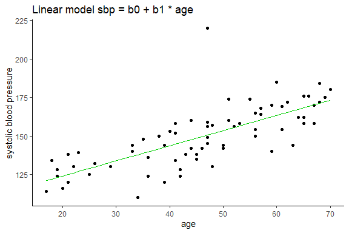<!-- -->


### Verification of the Model 1 assumptions

Before performing the statistical tests, you can look at the three graphs below to roughly determine the characteristics of the model.


```r
plot(m1, which = 1:3)
```

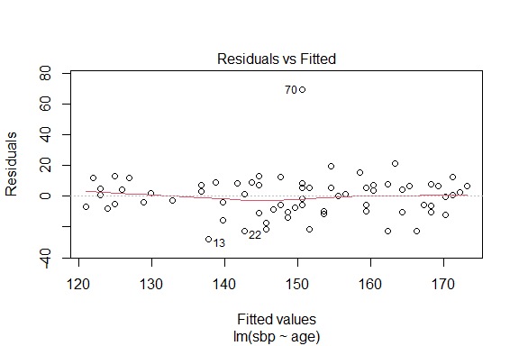<!-- -->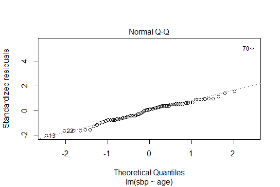<!-- -->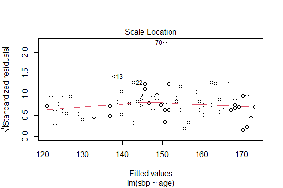<!-- -->

From the graphs it can be concluded that the mean value of the residuals is close to 0, which means that the assumption of a linear relationship was valid. Moreover, the variance of the random term is constant (there is homoscedasticity). There is an outlier, denoted as observation number 70, which distorts the estimate and rules out the normality of the distribution of the residuals.


#### Statistical tests


##### Shapiro-Wilk normality test for residuals


```r
shapiro.test(m1$residuals)
```

```
## 
## 	Shapiro-Wilk normality test
## 
## data:  m1$residuals
## W = 0.87623, p-value = 5.035e-06
```
**Conclusion**: `p-value < 0.05`, we reject the null hypothesis of normal residual distribution.


##### Breusch-Pagan test for heteroskedasticity


```r
bptest(m1)
```

```
## 
## 	studentized Breusch-Pagan test
## 
## data:  m1
## BP = 0.013838, df = 1, p-value = 0.9064
```

**Conclusion**: `p-value > 0.05`, no grounds for rejecting the null hypothesis, the residuals are distributed with equal variance.

##### Durbin-Watson test for autocorrelation 


```r
dwtest(m1, order.by = ~age, data = df)
```

```
## 
## 	Durbin-Watson test
## 
## data:  m1
## DW = 2.3105, p-value = 0.8826
## alternative hypothesis: true autocorrelation is greater than 0
```

**Conclusion**: `p-value > 0.05`, no grounds for rejecting the null hypothesis, the residuals are not autocorrelated.


##### Harvey-Collier test for linearity


```r
harvtest(m1, order.by = ~age, data = df)
```

```
## 
## 	Harvey-Collier test
## 
## data:  m1
## HC = 0.52181, df = 67, p-value = 0.6035
```

**Conclusion**: `p-value > 0.05`, no grounds for rejecting the null hypothesis, the regression is correctly modeled as linear.


##### Detecting influential observations

The following graphs show the assessment of the impact of individual observations on the structural parameters of Model 1 using measures: Cook's distance, leverage influence indicator.


```r
plot(m1, which = 4:5)
```

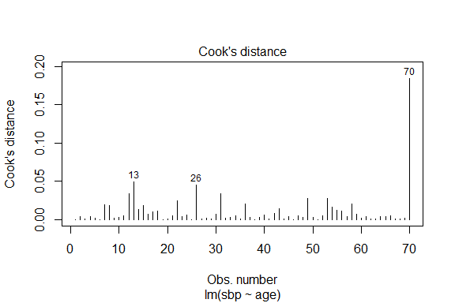<!-- --><!-- -->

### Estimation of Model 2

The model below was estimated after discarding atypical observation number 70.


```r
m2 <- lm(sbp ~ age, data = df, subset = 1:69)
summary(m2)
```

```
## 
## Call:
## lm(formula = sbp ~ age, data = df, subset = 1:69)
## 
## Residuals:
##     Min      1Q  Median      3Q     Max 
## -26.782  -7.632   1.968   8.201  22.651 
## 
## Coefficients:
##              Estimate Std. Error t value Pr(>|t|)    
## (Intercept) 103.34905    4.33190   23.86   <2e-16 ***
## age           0.98333    0.08929   11.01   <2e-16 ***
## ---
## Signif. codes:  0 '***' 0.001 '**' 0.01 '*' 0.05 '.' 0.1 ' ' 1
## 
## Residual standard error: 11.1 on 67 degrees of freedom
## Multiple R-squared:  0.6441,	Adjusted R-squared:  0.6388 
## F-statistic: 121.3 on 1 and 67 DF,  p-value: < 2.2e-16
```

Model 2: $y_{i} = 103.3491 + 0.9833x_{1} + e_{i}$

**Findings**: The standard deviation of residuals decreased and the degree of explanation of variability by the model increased to 63%.


The chart below shows a comparison between model 1 and model 2, before and after the rejection of outliers.


```r
ggplot() +
  ggtitle("Linear models comparison", 
          subtitle= "          green line - model for the entire set, 
          orange line - model after discarding outliers") +
  geom_point(aes(df$age, df$sbp)) +
  geom_line(aes(m1$model$age, m1$fitted.values), color = "green3") +
  geom_line(aes(m2$model$age, m2$fitted.values), color = "darkorange") +
  xlab("age")+
  ylab("systolic blood pressure") +
  theme_classic()
```

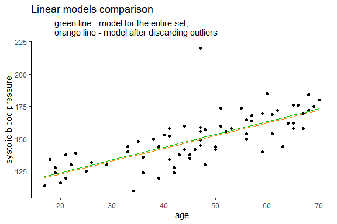<!-- -->

### Verification of the Model 2 assumptions

Diagnostic charts for Model 2.


```r
plot(m2)
```

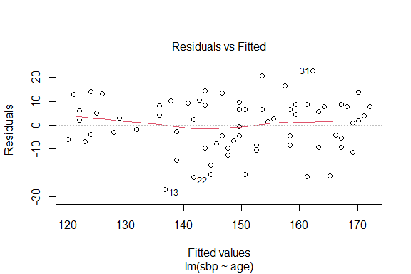<!-- -->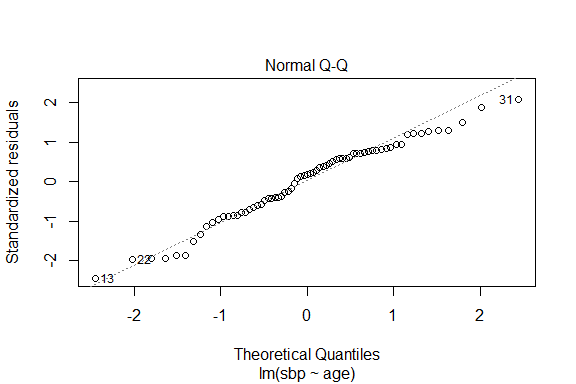<!-- -->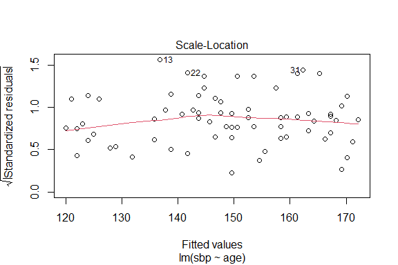<!-- -->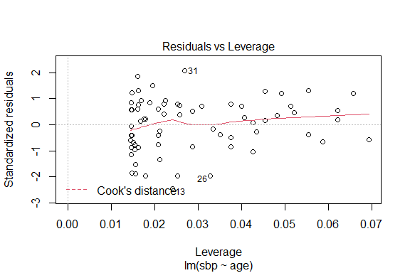<!-- -->

There are only slight changes in the charts. The fit of the values in the Normal Q-Q plot has improved.

#### Statistical tests


##### Shapiro-Wilk normality test for residuals


```r
shapiro.test(m2$residuals)
```

```
## 
## 	Shapiro-Wilk normality test
## 
## data:  m2$residuals
## W = 0.97263, p-value = 0.134
```
**Conclusion**: `p-value > 0.05`, no grounds for rejecting the null hypothesis, the residuals are normally distributed.


##### Breusch-Pagan test for heteroskedasticity


```r
bptest(m2)
```

```
## 
## 	studentized Breusch-Pagan test
## 
## data:  m2
## BP = 0.060841, df = 1, p-value = 0.8052
```

**Conclusion**: `p-value > 0.05`, no grounds for rejecting the null hypothesis, the residuals are distributed with equal variance.

##### Durbin-Watson test for autocorrelation 


```r
dwtest(m2, order.by = ~age, data = df[1:69,])
```

```
## 
## 	Durbin-Watson test
## 
## data:  m2
## DW = 2.1141, p-value = 0.6373
## alternative hypothesis: true autocorrelation is greater than 0
```

**Conclusion**: `p-value > 0.05`, no grounds for rejecting the null hypothesis, the residuals are not autocorrelated.


##### Harvey-Collier test for linearity


```r
harvtest(m2, order.by = ~age, data = df[1:69,])
```

```
## 
## 	Harvey-Collier test
## 
## data:  m2
## HC = 0.79742, df = 66, p-value = 0.4281
```

**Conclusion**: `p-value > 0.05`, no grounds for rejecting the null hypothesis, the regression is correctly modeled as linear.

##### Bonferroni Outlier Test


```r
outlierTest(m1, n.max = Inf)
```

```
##    rstudent unadjusted p-value Bonferroni p
## 70 6.297744         2.6747e-08   1.8723e-06
```

```r
outlierTest(m2, n.max = Inf)
```

```
## No Studentized residuals with Bonferroni p < 0.05
## Largest |rstudent|:
##     rstudent unadjusted p-value Bonferroni p
## 13 -2.538813           0.013489      0.93071
```

Based on the Bonferroni test, it can be seen that after excluding outlier number 70, there is no need to remove other observations.


## Linear model with age and gender variables

### Estimation of Model 3


```r
m3 <- lm(sbp ~ age + gender, data = df, subset = 1:69)
summary(m3)
```

```
## 
## Call:
## lm(formula = sbp ~ age + gender, data = df, subset = 1:69)
## 
## Residuals:
##     Min      1Q  Median      3Q     Max 
## -20.705  -3.299   1.248   4.325  21.160 
## 
## Coefficients:
##             Estimate Std. Error t value Pr(>|t|)    
## (Intercept) 96.77353    3.62085  26.727  < 2e-16 ***
## age          0.95606    0.07153  13.366  < 2e-16 ***
## gendermale  13.51345    2.16932   6.229  3.7e-08 ***
## ---
## Signif. codes:  0 '***' 0.001 '**' 0.01 '*' 0.05 '.' 0.1 ' ' 1
## 
## Residual standard error: 8.878 on 66 degrees of freedom
## Multiple R-squared:  0.7759,	Adjusted R-squared:  0.7691 
## F-statistic: 114.2 on 2 and 66 DF,  p-value: < 2.2e-16
```
Model 3: $y_{i} = 96.7735 + 0.9872x_{1} + 13.5135x_{2} + e_{i}$

**Findings**: The standard deviation of residuals decreased further and the degree of explanation of variability by the model increased to 77%.

Shown below in the graph is Model 3 for men and women.


```r
ggplot() +
  ggtitle("Linear model sbp = b0 + b1 * age + b2 * gender", 
          subtitle= "          blue - male
          red - female") +
  geom_point(aes(m3$model[m3$model$gender=="male",]$age, m3$model[m3$model$gender=="male",]$sbp), color = "blue") +
  geom_point(aes(m3$model[m3$model$gender=="female",]$age, m3$model[m3$model$gender=="female",]$sbp), color = "red") +
  geom_line(aes(m3$model[m3$model$gender=="male",]$age, predict(m3, data.frame(age = m3$model[m3$model$gender=="male",]$age, gender ="male"))), color = "blue") +
  geom_line(aes(m3$model[m3$model$gender=="female",]$age, predict(m3, data.frame(age = m3$model[m3$model$gender=="female",]$age, gender ="female"))), color = "red") +
  xlab("age")+
  ylab("systolic blood pressure") +
  theme_classic()
```

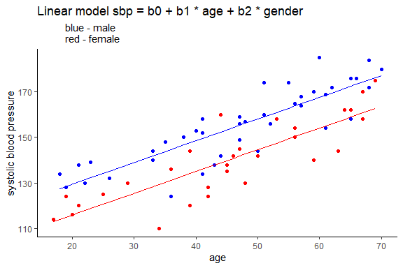<!-- -->

**Interpretation of Model 3 parameters**

The constant term `b0 = 96.7` in this model is not interpreted as the study did not include infants or children.

For `b1 = 0.9561` with the variable` age`
If the age increases by 1 year, the blood pressure will increase by an average of 0.9561 mmHg for people of the same sex, ceteris paribus.

For `b2 = 13.5134` with the variable` gender`
The blood pressure of men is on average 13.51 mmHg higher than that of women of the same age, ceteris paribus.

### Verification of the Model 3 assumptions

Checking whether explanatory variables are not collinear.


```r
vif(m3)
```

```
##      age   gender 
## 1.003759 1.003759
```

Diagnostic charts for Model 3


```r
plot(m3)
```

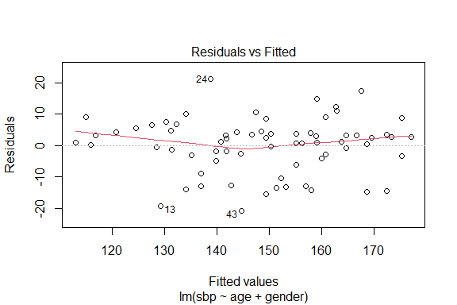<!-- --><!-- -->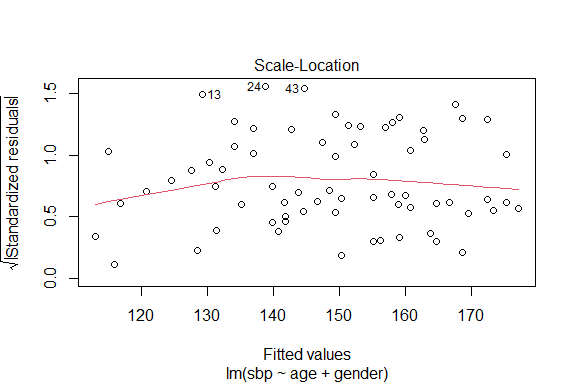<!-- -->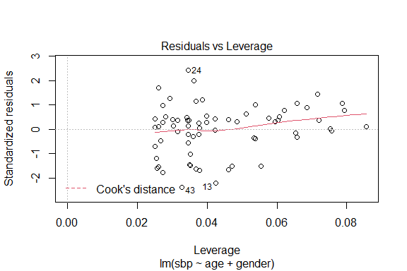<!-- -->

#### Statistical tests


##### Shapiro-Wilk normality test for residuals


```r
shapiro.test(m3$residuals)
```

```
## 
## 	Shapiro-Wilk normality test
## 
## data:  m3$residuals
## W = 0.95573, p-value = 0.01567
```
**Conclusion**: `p-value < 0.05`, we reject the null hypothesis of normal residual distribution.


##### Breusch-Pagan test for heteroskedasticity


```r
bptest(m3)
```

```
## 
## 	studentized Breusch-Pagan test
## 
## data:  m3
## BP = 0.66927, df = 2, p-value = 0.7156
```

**Conclusion**: `p-value > 0.05`, no grounds for rejecting the null hypothesis, the residuals are distributed with equal variance.

##### Durbin-Watson test for autocorrelation 


```r
dwtest(m3, order.by = ~age, data = df[1:69,])
```

```
## 
## 	Durbin-Watson test
## 
## data:  m3
## DW = 2.2791, p-value = 0.8545
## alternative hypothesis: true autocorrelation is greater than 0
```

**Conclusion**: `p-value > 0.05`, no grounds for rejecting the null hypothesis, the residuals are not autocorrelated.


##### Harvey-Collier test for linearity


```r
harvtest(m3, order.by = ~age, data = df[1:69,])
```

```
## 
## 	Harvey-Collier test
## 
## data:  m3
## HC = 1.2289, df = 65, p-value = 0.2235
```

**Conclusion**: `p-value > 0.05`, no grounds for rejecting the null hypothesis, the regression is correctly modeled as linear.


## Summary

In model 2, the residuals are normally distributed, but the model explains only 64% of the variation in blood pressure. When the gender variable was added, the fit of the model improved: the standard deviation of the residuals decreased, Model 3 explained 77% of the blood pressure development, but the residuals did not have a normal distribution. Another form of model is needed.
