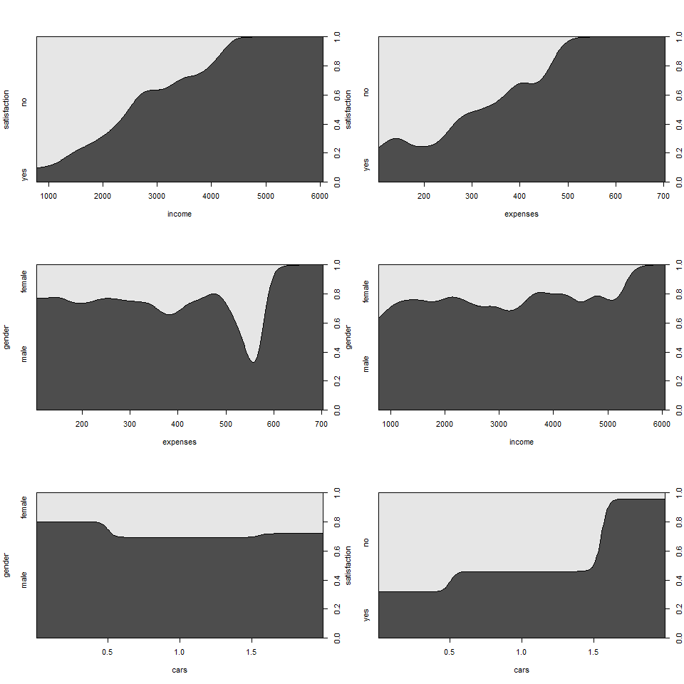
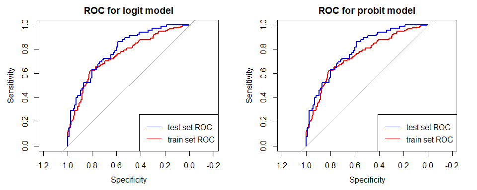

# Analytical exercise of building a logit and probit model
This document presents the process of building a logit and probit models that explains the satisfaction with the financial situation of the households surveyed.

The file `gosp_dom.csv` contains data on a sample of 500 randomly selected households in a certain voivodeship of Poland. For these households, the values of the following variables were obtained:

- income – average monthly income per person in a household,
- expenses – average monthly expenses per person in a household,
- gender – gender of the household head,
- cars – number of cars in the household,
- satisfaction - satisfaction with the financial situation.

Data source: University of Gdansk

#### Used libraries

```r
library("car")
library("ggplot2")
library("pscl")
library("pROC")
library("gridExtra")
```

## Data loading and initial analysis

```r
setwd("D:/Dev/GitHub/parametric-statistical-models")
df <-  read.table("data/households.csv", header = TRUE, sep = ";",dec=",")
df$gender <- as.factor(df$gender)
df$satisfaction <- as.factor(df$satisfaction)
```

Descriptive statistics for variables in the dataset:


```
##      income        expenses        gender         cars       satisfaction
##  Min.   : 776   Min.   :104.0   female:127   Min.   :0.000   no :291     
##  1st Qu.:1672   1st Qu.:198.0   male  :373   1st Qu.:0.000   yes:209     
##  Median :2168   Median :258.0                Median :1.000               
##  Mean   :2275   Mean   :267.0                Mean   :0.584               
##  3rd Qu.:2732   3rd Qu.:320.5                3rd Qu.:1.000               
##  Max.   :6062   Max.   :704.0                Max.   :2.000
```

There are definitely more men than women in the dataset.

### Relationship between material satisfaction and potential predictors
Graphs describing how the conditional distribution of a categorical variable (in this case satisfaction with the material situation) changes over a numerical variable.


```r
par(mfrow = c(3,2))
cdplot(df$income, df$satisfaction, xlab = "income", ylab = "satisfaction")
cdplot(df$expenses, df$satisfaction, xlab = "expenses", ylab = "satisfaction")
cdplot(df$expenses, df$gender, xlab = "expenses", ylab = "gender")
cdplot(df$income, df$gender, xlab = "income", ylab = "gender")
cdplot(df$cars, df$gender, xlab = "cars", ylab = "gender")
cdplot(df$cars, df$satisfaction, xlab = "cars", ylab = "satisfaction")
```

<!-- -->

The first charts show a fairly strong positive relation between income/expenses and satisfaction. There is also a positive relation between satisfaction and the number of cars. An interesting spike in women's expenses is visible in the relation between expenses and gender.

### Dividing dataset into training and test
The train set is used to build the model, and the test set is used to evaluate the model. We will make a random division in the proportion: 70% and 30% respectively. Each time the function `sample()` is called, we get a different set. In order to repeat the experiment, the `set.seed()` function is used, which initializes the "seed" for the random number generator - for a fixed "seed" at any time and on each device, the same set of random numbers is obtained.


```r
set.seed(1257)
n <- nrow(df)
rand_num <- sample(c(1:n), round(0.7*n), replace = FALSE)
df_train <- df[rand_num,]
df_test <- df[-rand_num,]
```

Checking the proportions of satisfied and dissatisfied in data subsets.


```r
table(df$satisfaction)/nrow(df)
table(df_train$satisfaction)/nrow(df_train)
table(df_test$satisfaction)/nrow(df_test)
```

**Original dataset**

```
## 
##    no   yes 
## 0.582 0.418
```
**Train subset**

```
## 
##        no       yes 
## 0.5885714 0.4114286
```
**Test subset**

```
## 
##        no       yes 
## 0.5666667 0.4333333
```

The proportion of satisfied and dissatisfied in the test and train sets is acceptable.

### Checking the correlation of explanatory variables
The variables used to build the model must not be overly correlated. To avoid this, a correlation threshold of 0.7 will be adopted

Correlation matrix for explanatory numerical variables.

```r
cor(df_train[,c(1,2,4)])
```

```
##             income  expenses      cars
## income   1.0000000 0.7790592 0.5065201
## expenses 0.7790592 1.0000000 0.3872822
## cars     0.5065201 0.3872822 1.0000000
```

All variables are statistically significantly correlated. However, there is over-correlation with expenses and income.

## Estimation of one-factor binomial logit models
We estimate the model for the dichotomous variable Y `family = binomial` with the default probit link function `link = logit`.


```r
logit1 <- glm(satisfaction ~ income, data = df_train, family = binomial)
logit2 <- glm(satisfaction ~ expenses, data = df_train, family = binomial)
logit3 <- glm(satisfaction ~ cars, data = df_train, family = binomial)
logit4 <- glm(satisfaction ~ gender, data = df_train, family = binomial)
summary(logit1)$coefficients
summary(logit2)$coefficients
summary(logit3)$coefficients
summary(logit4)$coefficients
```
**satisfaction ~ income**

```
##                 Estimate   Std. Error   z value     Pr(>|z|)
## (Intercept) -3.229664931 0.4147473253 -7.787066 6.858295e-15
## income       0.001265811 0.0001762309  7.182681 6.835748e-13
```
**satisfaction ~ expenses**

```
##                 Estimate  Std. Error   z value     Pr(>|z|)
## (Intercept) -2.447534344 0.387400960 -6.317832 2.652574e-10
## expenses     0.007864155 0.001384809  5.678873 1.355852e-08
```
**satisfaction ~ cars**

```
##               Estimate Std. Error   z value     Pr(>|z|)
## (Intercept) -0.9344403  0.1641035 -5.694214 1.239419e-08
## cars         0.9744850  0.1957512  4.978181 6.418458e-07
```
**satisfaction ~ gender**

```
##                Estimate Std. Error    z value  Pr(>|z|)
## (Intercept) -0.31365756  0.2134164 -1.4696976 0.1416437
## gendermale  -0.05985595  0.2479396 -0.2414135 0.8092347
```

### Evaluation of logit models 1-4

```r
binomial_model_eval <- function(model) {
  AIC <- c(model$aic)
  McFadden<-pR2(model)[4]
  Cragg_Uhler<-pR2(model)[6]
  score <- data.frame(AIC, McFadden, Cragg_Uhler)
  return(score)
}
eval_res_logit <- rbind(
  model_1=binomial_model_eval(logit1), 
  model_2=binomial_model_eval(logit2), 
  model_3=binomial_model_eval(logit3), 
  model_4=binomial_model_eval(logit4))
eval_res_logit
```

```
##              AIC     McFadden  Cragg_Uhler
## model_1 406.1737 0.1518221989 0.2505528834
## model_2 440.6419 0.0791292275 0.1370025151
## model_3 451.3945 0.0564522969 0.0992298264
## model_4 478.1038 0.0001227258 0.0002240586
```

**Findings**: Model 1 is the best model because the AIC criterion is the smallest and the other measures are the largest.

Is it possible to attach any other explanatory variable to the model?


```r
logit0 <- glm(satisfaction ~ income + cars, data = df_train, family = binomial)
summary(logit0)$coefficients
```

```
##                Estimate   Std. Error   z value     Pr(>|z|)
## (Intercept) -3.19082633 0.4164094321 -7.662714 1.820446e-14
## income       0.00116517 0.0001884432  6.183135 6.284090e-10
## cars         0.33891164 0.2358166332  1.437183 1.506660e-01
```

No variable can be included - after adding variable `car` it becomes irrelevant and `gender` turned out to be irrelevant before.

## Model selection and interpretation
The model `logit1` was selected.


```r
logit1$coefficients
cat("\nexp(bi)\n")
exp(logit1$coefficients)
cat("\nexp(100*bi)\n")
exp(logit1$coefficients[2]*100)
```
$logit(p) = -3,2297 + 0,0013 * income$

$logit(p) = ln(\frac{p}{1-p})$

$chance = \frac{p}{1-p} = exp(-3,2297+0,0013*income)$

$\frac{p}{1-p}=e^{b_0+b_1*x_1}$

$e^{b_0}$ -> chance when $x_i=0$

$e^{b_1}$ -> odds ratio

**Interpretation of Model 5 parameters**

`exp(b0) = 0.040`, where `b0` is an intercept, is interpreted as a chance of an event in the reference group $x_i = 0$, if it makes logical sense - not here.

`exp(b1) = 1.0013` => `(exp(b)-1)*100% = 0.13%`

If the income increases by 1 PLN, the chance of satisfaction will increase by 0.13%.

`exp(100*b1) = 1.0013` => `(exp(100*b)-1)*100% = 13.5%`

If the income increases by 100 PLN, the chance of satisfaction will increase by 13.5%.

### Estimation of the probit binomial model
We estimate the model for the dichotomous variable Y `family = binomial` with the probit link function `link = probit`.


```r
probit1 <- glm(satisfaction ~ income, data = df_train, family = binomial(link=probit))
summary(probit1)$coefficients
```

```
##                  Estimate   Std. Error   z value     Pr(>|z|)
## (Intercept) -1.9516067015 2.346486e-01 -8.317145 9.010721e-17
## income       0.0007632861 9.978662e-05  7.649183 2.022602e-14
```

How do we interpret the parameters of the probit model?

In the case of the probit model, we determine whether a given variable is a stimulant (when $b_i>0$) or a destimulant of the model (when $b_i<0$).

### Comparative evaluation of `logit1` and `probit1` models

```r
eval_res__logit_probit <- rbind(
  model_logit_1=binomial_model_eval(logit1), 
  model_probit_1=binomial_model_eval(probit1))
eval_res__logit_probit
```


```
##                     AIC  McFadden Cragg_Uhler
## model_logit_1  406.1737 0.1518222   0.2505529
## model_probit_1 405.9998 0.1521889   0.2510978
```

**Conclusions**: Probit is a better model because the AIC criterion is the lowest and the pseudo-R2 measures are higher.

### Comparison of the prediction quality of `logit1` and `probit1` models
Relevance tables for the selected cut-off point p*.

Let p* = the proportion of the training sample.

**Relevance table for the logit model - train set**

```
##         predicted
## observed   0   1
##        0 153  53
##        1  50  94
```

**Relevance table for the probit model - train set**

```
##         predicted
## observed   0   1
##        0 152  54
##        1  49  95
```

**Relevance table for the logit model - test set**

```
##         predicted
## observed  0  1
##      no  58 27
##      yes 18 47
```

**Relevance table for the probit model - test set**

```
##         predicted
## observed  0  1
##      no  57 28
##      yes 18 47
```


### Prediction quality measures
Measurements based on the relevance table for the selected cut-off point p*.

The following function `pred_measure` has been specified for the arguments: `model` (binomial model), `data` (e.g. training set, test set), `Y` (observed Y 0-1 in the analyzed data set).


```r
pred_measure <- function(model, data, Y, p = 0.5) {
  tab <- table(observed = Y, predicted = ifelse(predict(model, data, type = "response") > p, 1, 0))
  ACC <- (tab[1,1]+tab[2,2])/sum(tab)
  ER <- (tab[1,2]+tab[2,1])/sum(tab)
  SENS <- (tab[2,2]/(tab[2,1]+tab[2,2]))
  SPEC <- (tab[1,1]/(tab[1,1]+tab[1,2]))
  PPV <- (tab[2,2]/(tab[1,2]+tab[2,2]))
  NPV <- (tab[1,1]/(tab[1,1]+tab[2,1]))
  measures <- data.frame(ACC, ER, SENS, SPEC, PPV, NPV)
  return(measures)
}
```

Assessment of predictive ability on the train set.


```
##                    ACC        ER      SENS      SPEC       PPV       NPV
## model_logit  0.7057143 0.2942857 0.6527778 0.7427184 0.6394558 0.7536946
## model_probit 0.7057143 0.2942857 0.6597222 0.7378641 0.6375839 0.7562189
```

Assessment of predictive ability on the test set.


```
##                    ACC        ER      SENS      SPEC       PPV       NPV
## model_logit  0.7000000 0.3000000 0.7230769 0.6823529 0.6351351 0.7631579
## model_probit 0.6933333 0.3066667 0.7230769 0.6705882 0.6266667 0.7600000
```

**Findings**: Based on the above prediction quality measures, it can be concluded that the logit model turned out to be better.

### Receiver Operating Characteristic curve
The ROC curve presents the quality of the model prediction for all possible cut-off points p* (is independent of p* selection). For the models estimated on the training set, the quality of prediction on the training and test sets was compared below.


```r
par(mfrow = c(1,2))
rocobj1 <- roc(logit1$y, logit1$fitted.values)
rocobj1_t <- roc(df_test$satisfaction, predict(logit1, df_test, type = "response"))
plot(rocobj1, main = "ROC for logit model", col="red")
lines(rocobj1_t, col="blue")
legend(x = "bottomright",legend=c("test set ROC", "train set ROC"),col=c("blue","red"),lty=1)

rocobj2 <- roc(probit1$y, probit1$fitted.values)
rocobj2_t <- roc(df_test$satisfaction, predict(probit1, df_test, type = "response"))
plot(rocobj2, main = "ROC for probit model", col="red")
lines(rocobj2_t, col="blue")
legend(x = "bottomright",legend=c("test set ROC", "train set ROC"),col=c("blue","red"),lty=1)
```

<!-- -->

### ROC curve area

For train set.

```r
area_AUC_logit<-as.numeric(auc(logit1$y, logit1$fitted.values))
area_AUC_probit<-as.numeric(auc(probit1$y, probit1$fitted.values))
area_AUC <- rbind(area_AUC_logit, area_AUC_probit)
area_AUC
```

```
##                      [,1]
## area_AUC_logit  0.7496123
## area_AUC_probit 0.7496123
```

For test set

```r
area_AUC_logit<-as.numeric(auc(df_test$satisfaction, predict(logit1, df_test, type = "response")))
area_AUC_probit<-as.numeric(auc(df_test$satisfaction, predict(probit1, df_test, type = "response")))
area_AUC <- rbind(area_AUC_logit, area_AUC_probit)
area_AUC
```

```
##                      [,1]
## area_AUC_logit  0.7910407
## area_AUC_probit 0.7910407
```

**Findings**: Based on the area under the ROC curve, it can be concluded that the model has sufficient predictive power.

## Summary

The preliminary calculation of one-factor logit models showed that the best choice of the variable explaining the satisfaction variable is revenue. Then, the probit and logit models were calculated for the determined variables. Initially, the AIC criterion and pseudo R2 measures showed that the probit model better explains the variability of the examined features. However, in terms of the quality of prediction, the logit model turned out to be better. Based on the analysis of the ROC curve, it was found that the logit model has sufficient predictive power.
